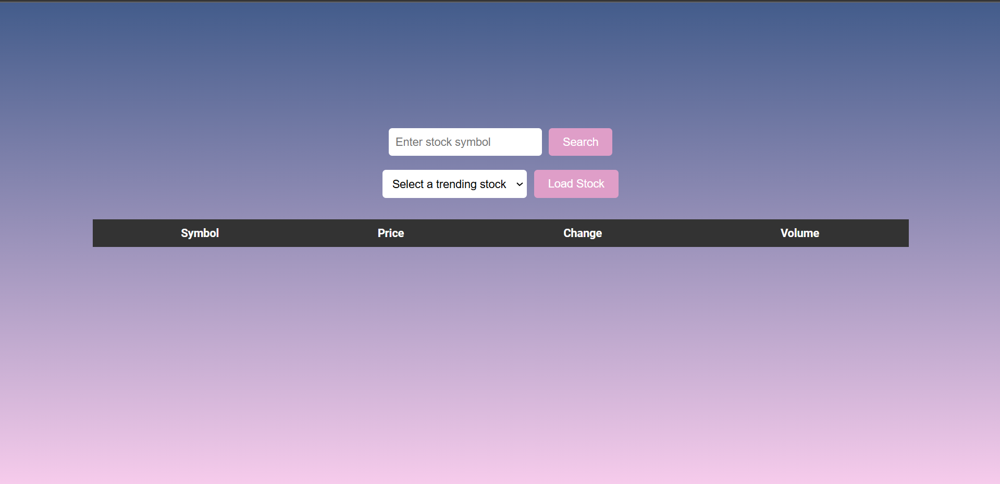
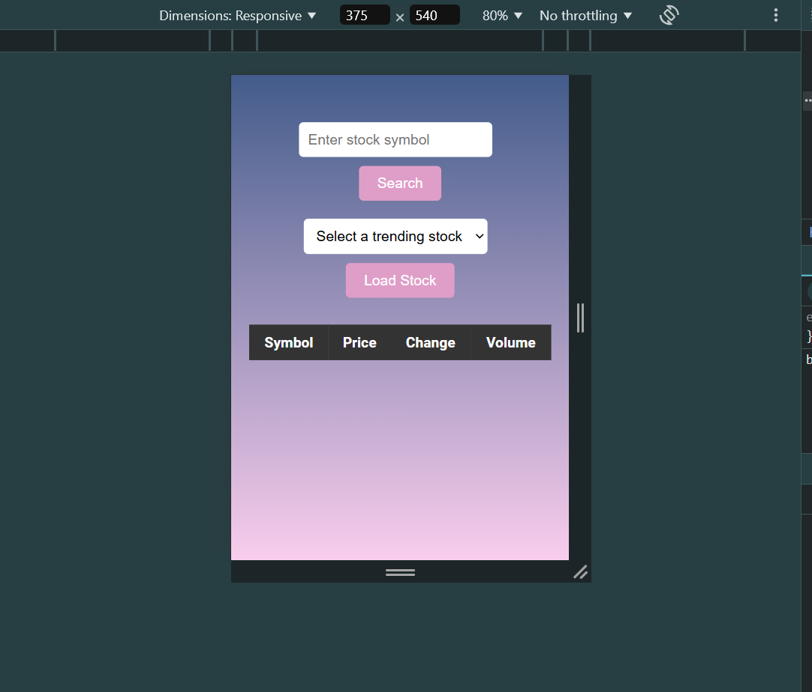

# Stock Tracker Application

## Overview
The Stock Tracker Application is a web-based tool for tracking stock prices and trends. It allows users to search for stock details, view trending stocks, and analyze stock price data visually using an interactive chart.

## Features
- **Search Stock**: Enter a stock symbol to fetch and display detailed information, including price, volume, and daily change.
- **Trending Stocks**: View and select from a list of pre-defined trending stocks.
- **Stock Comparison Table**: Compare stock data (symbol, price, change, and volume) in a tabular format.
- **Interactive Chart**: View historical stock price trends over the last 30 days using a responsive line chart.
- **Responsive Design**: Optimized for both desktop and mobile devices with a modern and intuitive UI.

## Technologies Used
- **HTML5**: Markup for structuring the application.
- **CSS3**: Styling with Flexbox for responsiveness and animations for better UX.
- **JavaScript**: Logic for fetching data, updating the UI, and rendering the chart.
- **Chart.js**: Visualization library for creating interactive charts.
- **Alpha Vantage API**: Source for stock market data.

## Installation

1. Clone this repository:
   ```bash
   git clone https://github.com/your-username/Project.git
   ```
2. Navigate to the project directory:
   ```bash
   cd Project
   ```
3. Open the `index.html` file in a browser to view the application.

## Configuration
1. Obtain an API key from [Alpha Vantage](https://www.alphavantage.co/).
2. Replace `YOUR_ALPHA_VANTAGE_API_KEY` in the `index.html` JavaScript code with your API key:
   ```javascript
   const apiKey = 'YOUR_ALPHA_VANTAGE_API_KEY';
   ```

## Usage
1. **Search for a Stock**:
   - Enter a stock symbol (e.g., `AAPL` for Apple) in the search bar and click the "Search" button.
   - Stock details, including price, change, and volume, will be displayed below.
2. **Select a Trending Stock**:
   - Choose a stock from the dropdown list and click "Load Stock."
   - Details and chart data for the selected stock will be displayed.
3. **Analyze Stock Data**:
   - Use the interactive chart to analyze historical stock price trends.
   - View stock comparison in the table for multiple stocks.

## File Structure
- **index.html**: The main HTML file containing the structure of the application.
- **style.css**: Contains styles for responsive and modern UI (embedded inline for simplicity).
- **script.js**: Contains JavaScript logic for fetching data, updating the DOM, and rendering the chart (embedded inline).

## Screenshots
### Desktop View


### Mobile View


## License
This project is licensed under the [MIT License](LICENSE).

## Acknowledgments
- [Alpha Vantage](https://www.alphavantage.co/) for providing stock market data.
- [Chart.js](https://www.chartjs.org/) for the chart visualization library.

---
Feel free to contribute by submitting issues or pull requests to enhance this application!
